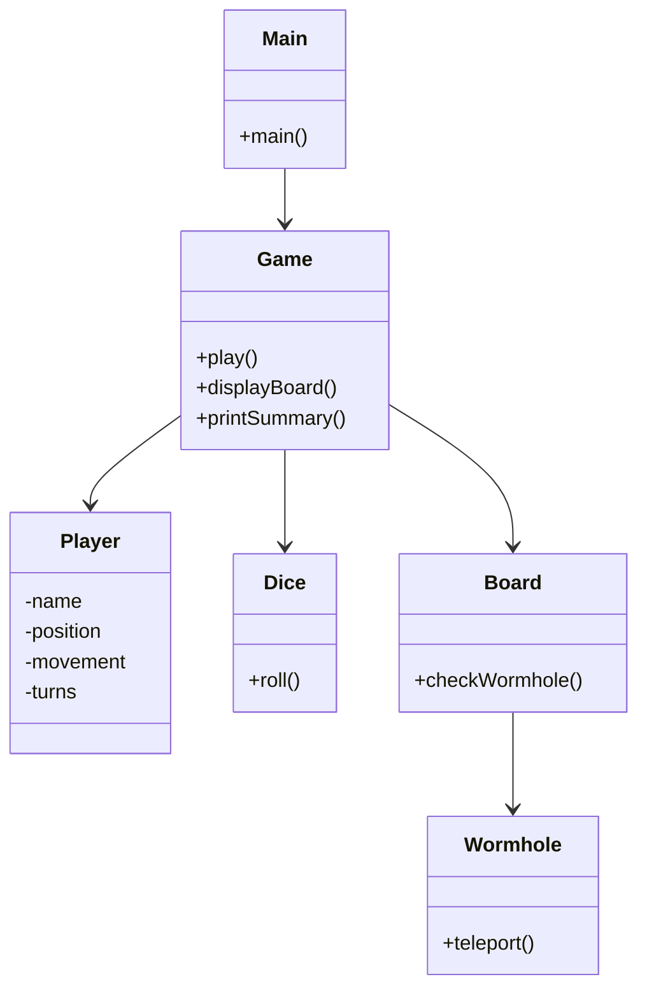

# Software-Design-and-Architecture

## Project Overview
This project is a Java console board game simulation.
The game supports:
- 2 to 4 players
- dice rolling
- wormholes
- hit rules
- turn tracking
- movement tracking
The game is played on a 6x6 board.
The first player to reach the end position wins.

# Features
## Implemented Features
- Multiple player support
- Random dice rolling
- Interactive turn system
- Starting player selection
- Board display
- Wormholes
- Hit rule
- Turn counting
- Movement counting
- Game state messages
- Final summary table

# How To Play
1. Start the program.
2. Choose number of players.
3. The game decides who starts first.
4. Press ENTER each turn.
5. Players roll two dice.
6. Players move around the board.
7. Wormholes teleport players.
8. Landing on another player cancels the move.
9. First player to reach the end wins.

# Classes
## Main Class
Starts the game.
Creates the Game object.

## Game Class
Controls:
- game loop
- turns
- movement
- board display
- wormholes
- hit rule
- winner checking

## Player Class
Stores:
- player name
- player position
- movement
- turns
- end position

## Dice Class
Generates random dice rolls.
Uses Java Random class.

## Board Class
Stores wormholes.
Checks teleport positions.

## Wormhole Class
Represents teleport locations on the board.

# Object Oriented Programming
This project uses Object Oriented Programming.
The program is separated into multiple classes.
Each class has its own responsibility.
This makes the code:
- cleaner
- easier to maintain
- easier to understand

# SOLID Principles
## Single Responsibility Principle
Each class performs one main task.
Examples:
- Dice handles dice rolling
- Player stores player data
- Board handles wormholes

# Game State System
The game contains different states:
- Ready
- In Play
- Game Over
These states are displayed during gameplay.

# UML Diagram

# Example Output
## Example Summary Table
| Player | Position | Turns | Movement |
|--------|----------|-------|----------|
| Red    |    35    |   4   |    34    |
| Blue   |     6    |   4   |    22    |
| Yellow |    12    |   3   |    24    |
| Green  |    23    |   3   |    18    |

Winner: Blue

# Design Decisions
The project was designed using multiple classes instead of one large file.
This improves:
- readability
- maintainability
- organisation
The console board was added to improve user interaction.
The game was designed as a simulation with interactive turns.

# Reflection
During this project I learned:
- how to create Java classes
- how objects interact
- how to use loops and lists
- how to create board game logic
- how to separate responsibilities between classes
The biggest challenge was implementing:
- movement logic
- hit rule
- wormholes
- board display

# Future Improvements
Possible future improvements:
- save/load system
- graphical interface
- replay system
- more board types
- more game rules
- multiplayer networking

# Conclusion
This project successfully creates a playable Java board game simulation.
The project demonstrates:
- object oriented programming
- multiple classes
- random gameplay
- board logic
- player interaction
- movement tracking
- console visualisation